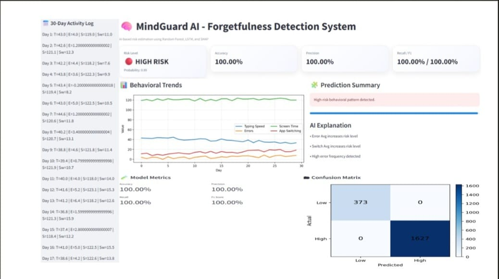

# 🧠 MindGuard AI - Forgetfulness Detection System



## Description

MindGuard AI is an AI-powered cognitive health monitoring system that predicts the risk of forgetfulness by analyzing user behavioral patterns. The system combines Random Forest and LSTM machine learning models with Explainable AI (SHAP) to estimate cognitive risk and provide interpretable insights. An interactive Streamlit dashboard visualizes behavioral trends, prediction results, and model performance metrics to support early cognitive risk assessment.

---

## Features

* AI-powered forgetfulness risk prediction
* Hybrid Random Forest and LSTM prediction model
* Explainable AI using SHAP feature importance
* Behavioral trend analysis over a 30-day period
* Interactive Streamlit dashboard
* Risk level classification (Low, Medium, High)
* AI-generated explanation for predictions
* Model evaluation metrics
* Confusion matrix visualization
* 30-day behavioral activity log

---

## Technologies Used

* Python
* Machine Learning
* Random Forest
* Long Short-Term Memory (LSTM)
* Explainable AI (SHAP)
* TensorFlow / Keras
* Scikit-learn
* Streamlit
* NumPy
* Matplotlib

---

## Dataset

The project generates a synthetic behavioral dataset for training and evaluation. It simulates 30-day user activity patterns including typing speed, typing errors, screen time, and application switching behavior to estimate cognitive risk.

---

## Project Structure

```text
MindGuard-AI/
│
├── app.py                 # Streamlit dashboard
├── model.py               # Hybrid AI prediction model
├── utils.py               # Risk level UI utilities
├── requirements.txt       # Project dependencies
├── output.jpeg            # Dashboard screenshot
├── README.md
└── LICENSE
```

---

## How to Run

1. Clone the repository

```bash
git clone https://github.com/<your-username>/MindGuard-AI.git
```

2. Navigate to the project directory

```bash
cd MindGuard-AI
```

3. Install the required packages

```bash
pip install -r requirements.txt
```

4. Launch the Streamlit application

```bash
streamlit run app.py
```

---

## Working Principle

1. Simulates 30 days of user behavioral data, including typing speed, typing errors, screen time, and application switching.
2. Extracts statistical and trend-based behavioral features.
3. Uses a Random Forest model to analyze tabular behavioral features.
4. Uses an LSTM neural network to learn temporal behavioral patterns.
5. Combines predictions from both models to estimate the probability of cognitive risk.
6. Applies SHAP Explainable AI to identify the most influential features affecting the prediction.
7. Displays behavioral trends, risk level, prediction probability, model metrics, confusion matrix, and AI explanations through an interactive Streamlit dashboard.

---

## Output

### MindGuard AI Dashboard


---

## Applications

* Early cognitive decline monitoring
* Forgetfulness risk assessment
* Digital health monitoring
* AI-assisted cognitive behavior analysis
* Healthcare research and education
* Machine learning demonstration project

---

## Future Enhancements

* Integration with wearable health devices
* Real-time behavioral data collection
* Personalized cognitive health recommendations
* Cloud deployment
* Mobile application support
* Multi-user authentication and database integration

---

## Author

**Mugila**

B.Tech Artificial Intelligence and Data Science

---

## License

This project is licensed under the MIT License.
